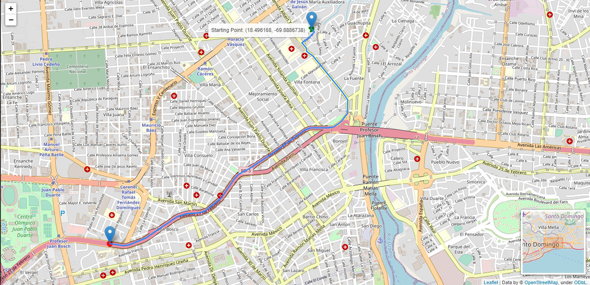

# Proyecto Maps Routing
En este proyecto busca desarrollar una solución tecnológica de IA que permita obtener la ruta óptima para llegar de un punto X a un punto Y en un mapa.

El proyecto consta de crear un agente de búsqueda que utilice la informacion de un mapa transformada en grafos compuesto de nodos y vértices, para asi poder analizarlo con el tipo de algoritmo de búsqueda que se adapte a nuestras necesidades que en este caso es la ruta mas optima en cuanto a distancia.

Para este proyecto se utiliza el algotimo UCS o mejor conocido como algoritmo de Dijsktra.

## El proyecto realiza las siguientes acciones 
* Convierte los datos cartográficos de OpenStreetMap (en sintaxis XML) a un grafo ponderado y direccionado con la representación de una lista de adyacencia.
* Muestra la ruta solución en un mapa indicando los pasos que se deben realizar en el mapa real para llegar al destino.
* El grafo toma en cuenta direccionalidad de las vías. 
* La distancia calculada es distancia por vía, no euclideana ni por aire. 
* Permite al usuario ingresar el punto de inicio y el final (En el archivo ucs.py [Latitud y Longitud]).
* El sistema permite ver el mapa al mostrar el resultado de la ruta hallada.
> Para iniciar el programa debe ejecutar el archivo ucs.py

